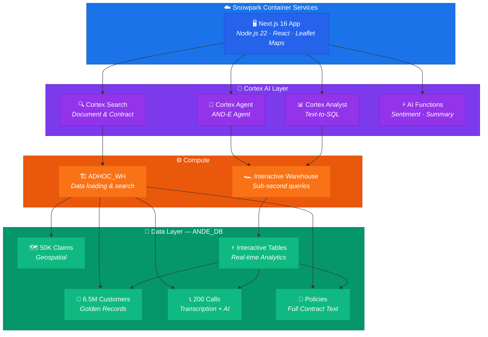
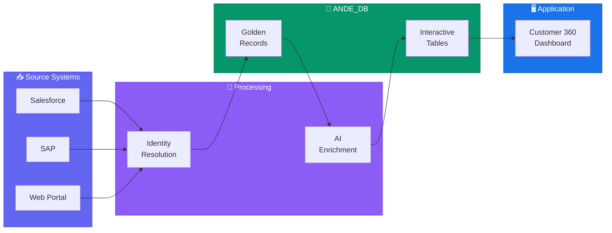
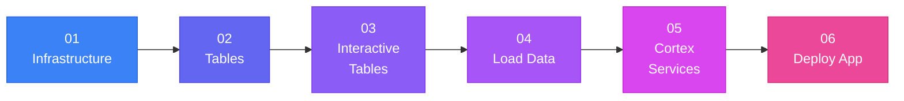
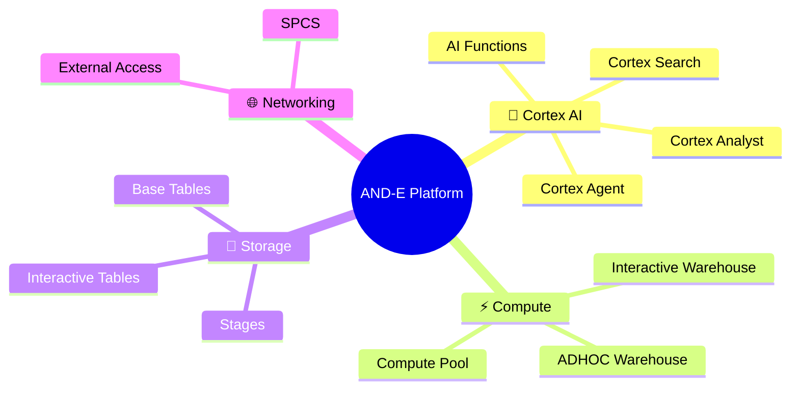

# AND-E Insurance — Customer 360 Platform

A Next.js application deployed on Snowflake SPCS (Snowpark Container Services) that provides a unified view of insurance customers, policies, claims, and call center operations powered by Cortex AI.

---

## Architecture



---

## Data Flow



---

## Features

| Tab | Description | Snowflake Service |
|-----|-------------|-------------------|
| **Home** | KPI dashboard — total customers, contracts, calls, claims | Interactive Warehouse |
| **Customer** | Search 6.5M records by company, name, email, phone, or ID | Interactive Tables |
| **Call Analytics** | Real-time call center metrics: AHT, CSAT, FCR, NPS | Cortex AI Functions |
| **Calls by Agent** | Per-agent call breakdown with sentiment analysis | Cortex AI Functions |
| **Red Flags** | AI-powered call governance — flagged profanity, threats, PII | Cortex AI Functions |
| **Green Flag** | FCA compliance checking — ensures regulatory statement in calls | Cortex AI Functions |
| **Policies** | Insurance policy viewer with contract search | Cortex Search |
| **Claims** | Claims management with status tracking | Interactive Warehouse |
| **Fraud** | Fraud detection dashboard for suspicious claims | Cortex Analyst |
| **Predictions** | Claims forecasting and staffing planner | Cortex Analyst |
| **GeoSpatial** | UK claims heatmap with mechanic coverage gap analysis | GEOGRAPHY types |
| **Agent** | Cortex AI Agent for natural language data queries | Cortex Agent |

---

## Install Sequence



### 1. Create Infrastructure

```bash
snowsql -f install/01_infrastructure.sql
```

### 2. Create Tables

```bash
snowsql -f install/02_tables.sql
```

### 3. Create Interactive Tables

```bash
snowsql -f install/03_interactive_tables.sql
```

### 4. Load Data

Export data from the source account and load into the new account:
```bash
snowsql -f install/04_load_data.sql
```

See `install/04_load_data.sql` for detailed export/import commands.

### 5. Create Cortex Services

```bash
snowsql -f install/05_cortex_services.sql
```

### 6. Deploy the App

```bash
cd app
snow app deploy
```

The app will build (~60s) and deploy (~30s). You'll get a public URL like:
```
https://xxxx-your-account.snowflakecomputing.app
```

---

## Prerequisites

- Snowflake account with ACCOUNTADMIN role
- SnowCLI installed (`pip install snowflake-cli`)
- Node.js 22+ (for local development only)

---

## Project Structure

```
ANDE_Native_App/
├── README.md
├── DEMO_SCRIPT_30MIN.md           # 30-minute technical demo walkthrough
├── DEMO_SCRIPT_20MIN_BUSINESS.md  # 20-minute business value demo
├── install/                        # SQL scripts (run in order)
│   ├── 01_infrastructure.sql       # Database, warehouses, compute pool, stage
│   ├── 02_tables.sql              # All table DDL
│   ├── 03_interactive_tables.sql   # Interactive tables + IWH binding
│   ├── 04_load_data.sql           # Data loading from stage
│   └── 05_cortex_services.sql     # Search, Semantic Views, Agent
├── data/
│   ├── call_recordings/           # MP4 call audio files
│   └── policy_documents/          # PDF insurance policies
└── app/
    ├── snowflake.yml              # SPCS deployment config
    ├── app.yml                    # App Runtime manifest
    ├── Dockerfile                 # Multi-stage Node.js build
    ├── package.json               # Dependencies
    ├── app/                       # Next.js app directory
    │   ├── page.tsx               # Main page with tabbed navigation
    │   ├── layout.tsx             # Root layout
    │   └── api/                   # Server-side API routes
    ├── components/                # React UI components
    ├── lib/snowflake.ts           # Snowflake SDK connection helper
    └── public/                    # Static assets (logos, icons)
```

---

## Key Snowflake Services



| Service | Purpose |
|---------|---------|
| **Cortex Agent** | Natural language interface to customer data |
| **Cortex Search** | Semantic search over insurance policy documents |
| **Cortex Analyst** | Text-to-SQL via semantic views |
| **Interactive Warehouse** | Sub-second query execution for real-time UX |
| **Interactive Tables** | Pre-cached data for instant agent responses |
| **SPCS** | Container deployment for the Next.js web app |
| **GEOGRAPHY** | Geospatial data types for claims mapping |

---

## Local Development

```bash
cd app
npm install
# Set up ~/.snowflake/connections.toml with your connection
npm run dev
# Open http://localhost:3000
```

## Environment Variables (auto-set in SPCS)

| Variable | Description |
|----------|-------------|
| `SNOWFLAKE_WAREHOUSE` | Default warehouse (ADHOC_WH) |
| `SNOWFLAKE_CONNECTION_NAME` | Connection name from config.toml |
